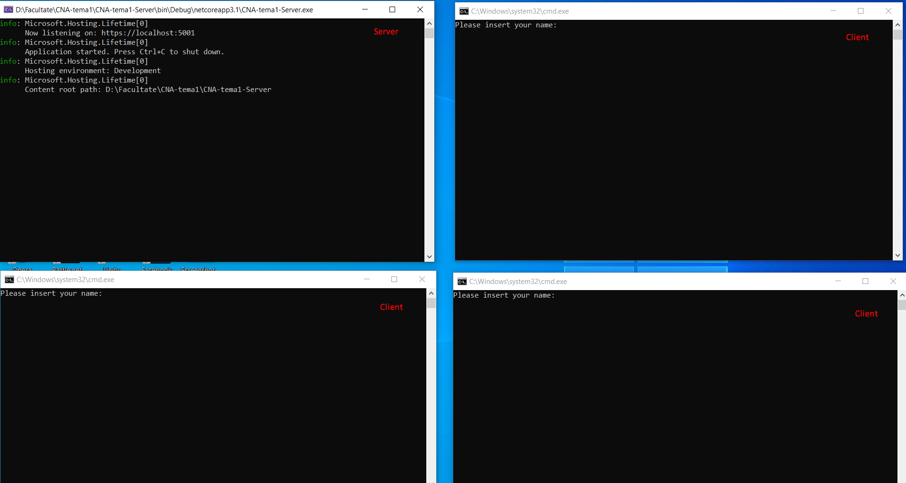
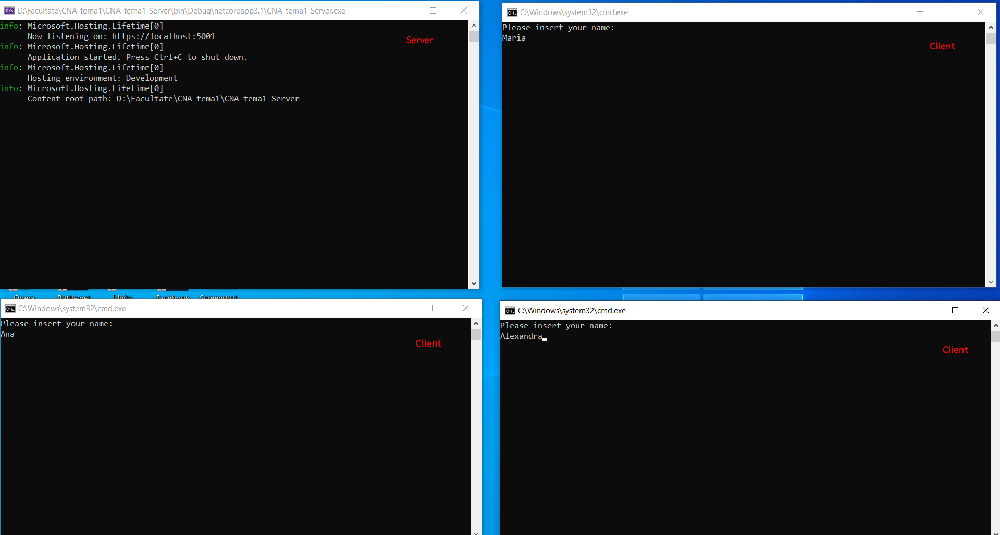
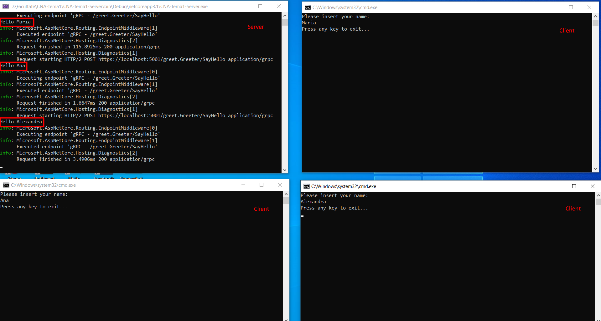

## Cloud Native Applications

### Tema 1 - Zaharia Alexandra

Functionalities:

1. Open a server and multiple clients

1. The clients can enter their names

1. The server will display for each client "_Hello -name-_"

Used **gRPC** and **Protobuf**.